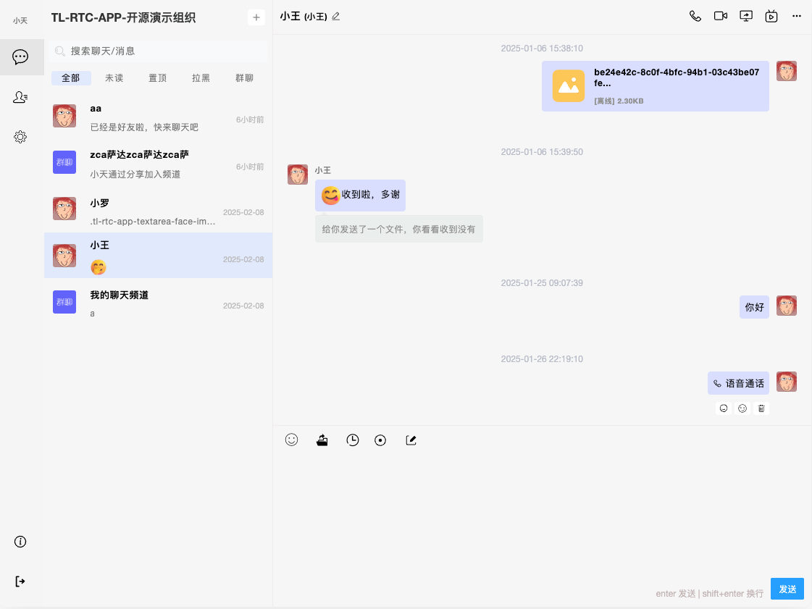

<p align="center">
  
</p>

### Preview



## Prerequisites

1. Install Node.js environment

2. Install MySQL environment

3. Install Redis environment

## Installation Steps

1. Clone the repository:

    ```bash
    git clone https://github.com/tl-open-source/tl-rtc-app.git
    ```
2. Navigate to the project directory:

    ```bash
    cd tl-rtc-app
    ```
3. Install dependencies:

    ```bash
    npm install
    ```

## Usage Instructions
1. Start the application - Api

    ```bash
    npm run http-api

    or

    npm run https-api
    ```

2. Start the application - Socket

    ```bash
    npm run http-socket

    or

    npm run https-socket
    ```

3. Open your browser and visit `http://localhost:9096`.

## License
This project is licensed under the MIT License. For more details, please refer to the [LICENSE](LICENSE) file.

## Disclaimer
For more details, please refer to the [DISCLAIMER](DISCLAIMER) file.
