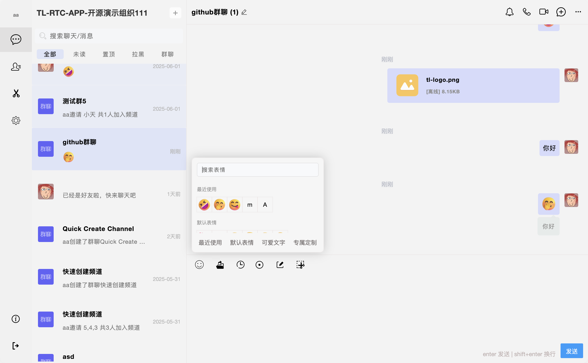

中文: [README_ZH.md](README_ZH.md)

<p align="center">
  
</p>

<p align="center">
  
</p>

### Installation Steps

1. Prerequisites

    ```bash
    Make sure Node.js (v16+), npm, MySQL (5.7+), and Redis (4.0+) are installed.
    ```

2. Clone the repository:

    ```bash
    git clone https://github.com/tl-open-source/tl-rtc-app.git
    ```

3. Enter the project directory:

    ```bash
    cd tl-rtc-app
    ```

4. Install dependencies:

    ```bash
    npm install
    ```

5. Install pm2 globally:

    ```bash
    npm install pm2 -g
    ```

6. Start the service:

    ```bash
    npm run http
    ```
    Or (for audio/video, screen sharing, live streaming, etc.):

    ```bash
    npm run https
    ```

7. Build frontend resources:

    ```bash
    gulp default
    ```

### Usage Instructions

1. Open your browser and visit `http://localhost:9096` (by default).

2. Manage IM applications through the admin panel at `http://localhost:9098/system.html` (by default).

### License

This project is licensed under the MIT License. For more details, please refer to the [LICENSE](LICENSE) file.

### Disclaimer

For more details, please refer to the [DISCLAIMER](DISCLAIMER) file.
