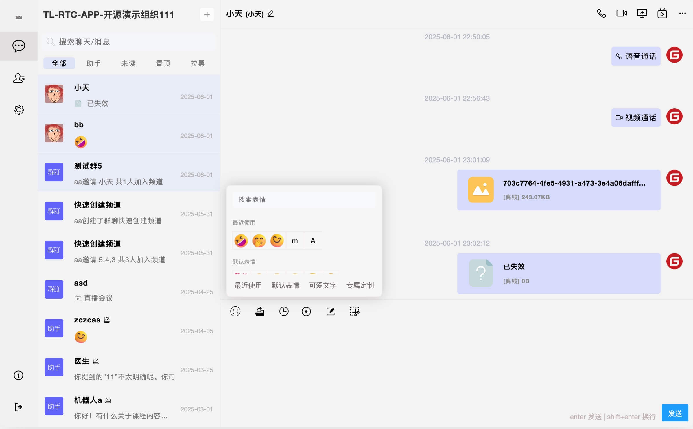

<p align="center">
  
</p>

<p align="center">
  
</p>


### 安装步骤

1. 克隆仓库：

    ```bash
    git clone https://github.com/tl-open-source/tl-rtc-app.git
    ```
   
2. 进入项目目录：

    ```bash
    cd tl-rtc-app
    ```
   
3. 安装依赖：

    ```bash
    npm install
    ```

4. 安装pm2:

    ```bash
    npm install pm2 -g
    ```

5. 启动后台管理服务：

    ```bash
    pm2 start npm --name=tl-rtc-app-super-api -- run http-super-api
    ```
    或者

    ```bash
    pm2 start npm --name=tl-rtc-app-super-api -- run https-super-api
    ```

6. 启动Api服务：

    ```bash
    pm2 start npm --name=tl-rtc-app-api -- run http-api
    ```
    或者

    ```bash
    pm2 start npm --name=tl-rtc-app-api -- run https-api
    ```

7. 启动Socket服务：

    ```bash
    pm2 start npm --name=tl-rtc-app-socket -- run http-socket
    ```
    或者

    ```bash
    pm2 start npm --name=tl-rtc-app-socket -- run https-socket
    ```

### 使用说明

1. 打开浏览器并访问 `http://localhost:9096` (默认)。

2. 通过管理端应用进行IM应用管理 `http://localhost:9098` (默认)。


### 许可证
该项目根据 MIT 许可证授权。有关详细信息，请参阅 [LICENSE](LICENSE) 文件。


### 免责声明
有关详细信息，请参阅 [DISCLAIMER](DISCLAIMER) 文件。
